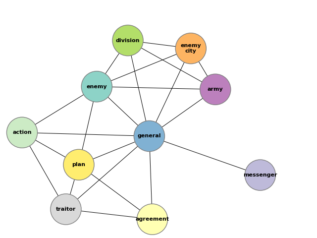
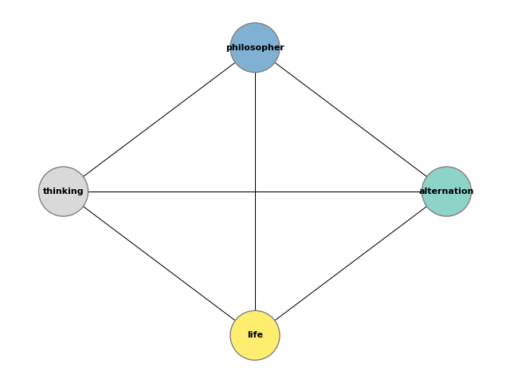
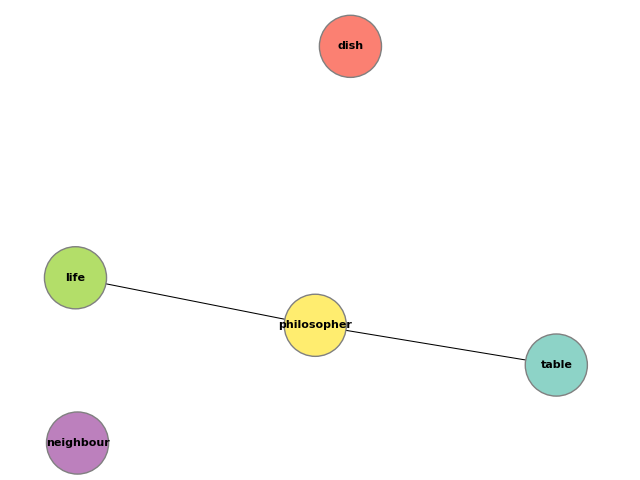
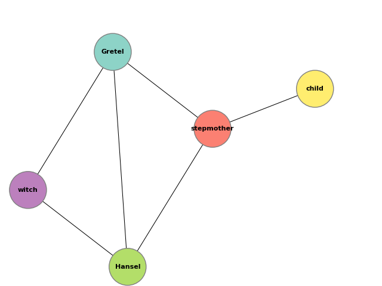
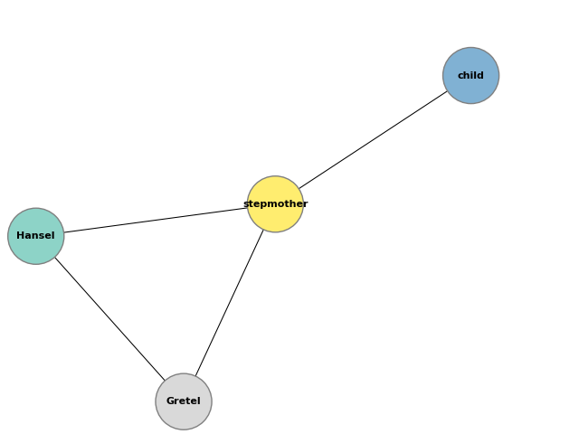

## NER

After being inspired by [this study](https://journals.plos.org/plosone/article?id=10.1371/journal.pone.0226025), the idea was to programmatically analyse a story (which is to act as a software specification) and extract the named entities (see [this](https://github.com/flairNLP/flair) and [this](https://home.aveek.io/blog/post/finding-main-characters/)). The idea was that once these were extracted, a model could be developed representing the relationships between each of these entities, with the hope of the end result being something similar to an ER diagram. Think of it as a pre-ER step. Perhaps it could be useful for comparing with the actual ER diagram which gets drawn up during the development stage. This could be taken even further by analyzing text to try and extract any "actions" that each entity performs....

... Unfortunately, the results of the first test (analyse.py) were disappointing in that the NER was not as accurate as expected. For example, it would have been ideal to get something along the lines of

`
extract_entities(fd.read()) -> {General, Messenger}
`

where, instead, an empty set gets returned. It's possible that the code is inadequate or the required technology for NLP is simply not here yet.


## Narrative Analysis

Following from the above, a more comprehensive approach was employed where, instead of simply relying on NER, narrative analysis was employed with the help of [Narcy](https://github.com/sztal/narcy#readme). The results of this are far more promising.


### Script Usage

```
$ python analyse_narrative --help

Usage: analyse_narrative.py [OPTIONS] FNAME COMMAND [ARGS]...

Options:
  --help  Show this message and exit.

Commands:
  draw-graph  Draw a graph by extracting entities from a piece of text
  dump-data   Dump analysis data to CSV files.
```

### Example Results

```
$ python analyse_narrative.py byzantine.txt draw-graph
```


```
$ python analyse_narrative.py philosophers.txt draw-graph -layout kawai -kw 8
```


```
$ python analyse_narrative.py philosophers.txt draw-graph -layout kawai -nsubj
```


```
$ python analyse_narrative.py hansel_and_gretel.txt draw-graph -avg -nsubj
```


```
$ python analyse_narrative.py hansel_and_gretel.txt draw-graph -avg -nsubj -kw 10
```



### TODO

* Extract better relationships (?)

