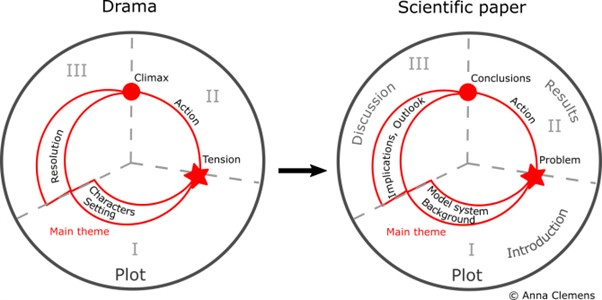

*06.10.2021*

## Summary

To summarise the suggested next steps, in time for our meeting next week:
1. Read the attached paper and think about two things:
1. Is the Byzantine Generals Problem a story - why/why not?
2. How does the Byzantine Generals Problem map to the computational problem of (un)reliable components in a software system?
2. Think about whether and how a Jupyter Notebooks environment could, in some way, implement the paper, e.g., could you combine story and software using Jupyter Notebooks.
3. Consider purchasing Alice LaPlante's "the making of a story" (and maybe go ahead and make the purchase  );
4. Consider purchasing Martin Erwig's "Once upon an Algorithm" (and again follow through on that decision);
5. Get the e-loan version of John Ousterhout's "The Philosophy of Software Design from the library"

Reference for preliminary report; computationaltales.blogspot.com/p/book.html

NOTE that the three books written by Jeremy Kubica are not the kind of thing we are trying to do, i.e., we’re not trying to do computer science education.

## Jupter Notebook

Notebook documents (or "notebooks", all lower case) are documents produced by the Jupyter Notebook App, which contain both computer code (e.g. python) and rich text elements (paragraph, equations, figures, links, etc…). Notebook documents are both human-readable documents containing the analysis description and the results (figures, tables, etc..) as well as executable documents which can be run to perform data analysis.

https://www.dataquest.io/blog/jupyter-notebook-tutorial/

## Literate Programming

Literate programming is a programming paradigm introduced by Donald Knuth in which a computer program is given an explanation in a natural language, such as English, interspersed with snippets of macros and traditional source code, from which a compliable source code can be generated.

The literate programming paradigm represents a move away from writing computer programs in the manner and order imposed by the computer, and instead enables programmers to develop programs in the order demanded by the logic and glow of their thoughts. Literate programs are written as an uninterrupted exposition of logic in an ordinary human language, **much like the text of an essay**, in which macros are included to hide abstractions and traditional source code. **The main intention behind this approach was to treat a program as literature understandable to human beings.**

https://en.wikipedia.org/wiki/Literate_programming

https://en.wikipedia.org/wiki/Axiom_(computer_algebra_system)

https://blog.bitsrc.io/literate-programming-a-radical-approach-to-writing-code-with-documentation-ebb5dc892cd7

## Narrative

A narrative, story or tale is any account of a series of related events or experiences, whether nonfictional (memoir, biography, news report, documentary, travelogue, etc.) or fictional (fairy tale, fable, legend, thriller, novel, etc.). Narratives can be presented through a sequence of written or spoken words, still or moving images, or any combination of these. The word derives from the Latin verb narrare (to tell), which is derived from the adjective gnarus (knowing or skilled). Along with argumentation, description, and exposition, narration, broadly defined, is one of four rhetorical modes of discourse. More narrowly defined, it is the fiction-writing mode in which the narrator communicates directly to the reader. The school of literary criticism known as Russian formalism has applied methods used to analyse narrative fiction to non-fictional texts such as political speeches.

https://en.wikipedia.org/wiki/Narrative

## What Makes a Story

A story has five basic but important elements. These five components are:

* Characters
* Setting
* Plot
* Conflict
* Resolution

What exactly classifies as a story. There are those that we instinctively know are “stories” but what about everything in between? Is a biography a story? Probably. How about a research paper? Does code tell a story of some sort? If we can apply the concepts of storytelling to something as abstract and scientific as academic papers, can we do the same with code?

https://edit911.com/the-art-of-storytelling-in-academic-writing-5-steps-to-a-better-research-paper/

https://www.g2i.co/blog/telling-a-story-with-your-code

Aristotle wrote:

> *A whole story is what has a beginning and a middle and end.*
> *A beginning is that which is not itself necessarily after anything else, and which has naturally something else after it. An end is that which is naturally after something itself, either as its necessary or usual consequent, and with nothing else after it. And a middle, that which is by nature after one thing and has also another after it.*

## Stories vs. Art and the Relationship With Code

What is art? Are stories art? Is code art? Some people believe so.
It is interesting to note that, already, some people see code as an artform, and others see themselves not as programmers or "coders"" but as authors, using not the medium of words, but of code.
