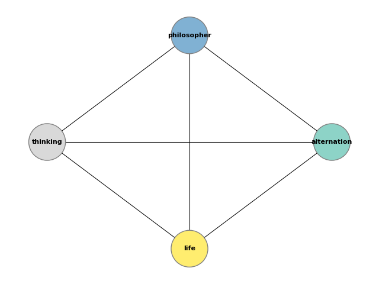

*21.01.2022*

The following is a summary of the work done from the Christmas break until now.


# Byzantine Generals Problem

Following from previous progress made on the BGP, an attempt was made at a third (and, hopefully, final) implementation where generals utilise the recursive communication algorithm described in the original research paper.

This implementation was much more difficult and time consuming than expected for a few reasons. In the BGP paper, for example, there is some difference between fig 3. and fig 4. (page 8) when lieutenants exchange messages despite both representing the OM(1) step of the algorithm. Likewise, there is some contradiction with regards to how exactly the algorithm works in various online sources.

Various different implementations were attempted - each of which failed to reproduce the results described in the paper. As part of this endeavour, the behavior of the `General` class had to be somewhat modified to work with the concept of a commanding general. The initial implementation looked like the following.

```python
for g in generals:
    if not g.acting_commander:
        g.listen(commander._id, commander.speak())

    if m > 0:
        for g in generals:
            if not g.acting_commander:
                g.promote()
                Messenger.traverse_generals(g.speak(order), generals, m-1, g)
                g.demote()
```

The final design which was settled for is one that is of a quite similar structure to that of JVerewolf's solution. With that said, the results of our solution do not match those of JVerewolf's exactly. Likewise, this solution fails to prove the claim that 3m+1 generals solves the BGP. Various tests revealed that this problem also existed in JVerewolf's code by simply modifying the behavior of the traitors (ie. adding randomness). It is true, indeed, that with 3m+1 generals, the odds of disagreement go down, however it is still possible. Moreover, in JVerewolf's code, all logic exists within the General class, which I believe to be a more reasonable way to approach the problem. In our implementation, however, the communication logic lives in side the Messenger class - this is more faithful to the story, but it made coding the solution a little more complicated.


# Dining Philosophers

Moving on from the Byzantine Generals, the next "story" that was looked at was that of the Dining Philosophers (as presented in EWD310, Edsger W. Dijkstra). One of the most obvious differences here when compared to the BGP was how well the story was separated from the engineering. In the DP paper, there was no confusion as to what constituted the story, as was the case with BGP. Thus, extracting the story was a trivial task. Drawing up a set of user stories was just as easy, however, assumptions still had to be made in various places - namely, relating to the motivation of the philosophers.

With the dining philosophers, a problem that appeared early on that was not present in the case of the BGP is that it was not entirely clear what code to actually implement based on the story. The story presented was just that - a story. There was no question to be answered or explicit problem to be solved. With th BGP it was almost as if the problem itself was the story, here, however, the problem and the story are somewhat distinct. Confusion arose in that it was not entirely clear if the code should simply model the story and demonstrate that the problem does, indeed, exist, or if it should solve the problem. Therefore, three different implementations were written:

1. A sequential model of the story which successfully demonstrates that the problem does exist.
2. A threaded model of the story which demonstrates that a deadlock exists when philosophers attempt to eat with forks that are in use.
3. A solution to the threaded model based on the solution presented in the paper.

The third implementation is likely the most interesting of the three as it actually solves the problem at hand. Unlike with the algorithm presented in the BGP paper, the algorithm here worked flawlessly and was quite trivial to implement in Python. One issue that arose, however, is that with the introduction of state variables and semaphore objects, it could be said the the implementation stepped outside the boundaries of the original story. Thus, the story was revised to include a short paragraph which would justify these design decisions. For completeness, it is given below.

> The philosophers overcome this problem by signalling amongst themselves whether or not it is appropriate to eat. When a philosopher lets the others know that he is hungry, he checks to make sure that none of his neighbors are eating before picking up his forks and consuming his meal. Once he is finished, he signals to his immediate neighbors that he is no longer eating. The philosophers next to him can then follow the same procedure should they get hungry. Thus, the philosophers ensure that no two neighbors attempt to eat their meal simultaneously.


# Hansel and Gretel

The final story which was looked at is that of Hansel and Gretel. With this story there was an apparent and immediate issue when it came to implementing it in code - extracting the story. The whole text was a story. The initial idea was to not extract anything and just treat the entire piece of text as our "specification", however it was not entirely clear how this would work. Therefore, with some inspiration from Erwig (Once Upon an Algorithm, Martin Erwig), it was settled on that the extracted story would be that of the description of Hansel's clever "path-finding" algorithm to find his way out of the forest. This choice makes sense as Hansel's "exploit" used to trick his stepmother could be almost called the "essence" of the H&G story. Moreover, the description of Hansel and Gretel's troubles as they try to navigate their way through the forest makes up 2 out of the 3 pages of the story.

Once the story had been extracted, it was not immediately obvious *how* to implement it. It was, however, quite clear from the story *what* to do - it was clear that a path-finding algorithm of sorts was required. In this regard, the H&G story was (surprisingly) more clear than that of the Dining Philosophers (**TODO: think about why that is!**).

The approach that was eventually settled for was to model Hansel as existing in 2D space where each of his pebbles dropped had an x and y coordinate. With this design in place, Hansel would simply walk forwards towards his destination, and to turn back home, he would follow the pebbles he dropped. This is all based on the location of the pebbles and on which pebble is visible from a given point - there is no "cheating" going on by simply iterating over the collection of pebbles in reverse order.

A further implementation was then written up where an attempt was made to make the initial implementation more "abstract". This proved to be quite a success - the result was a single, short method which accepts any generic graph described by a set of nodes and edges. Each node represents a "pebble" and an edge represents the visibility of pebbles. Thus, it is possible to traverse the graph to get from a starting point to an end point. Interestingly, the result of this implementation is not consistent with that of the original. This is likely due to the ordering of the "pebbles" or "nodes" and the sequence in which they are traversed. It is possible to extend this implementation even further by adding the option for Hansel to backtrack (so as to avoid getting stuck) and even prioritizing edges based on distance.


# Visualization

As part of the research for this project, an attempt has been made to visualize each story implementation in a suitable manner.

## Byzantine Generals

The BGP posed some problems when it came to visualization as it was unclear what to *actually* visualize. The original idea was to draw a node graph representing the communications that take place between the generals, however, this quickly got messy, even with a small number of generals. This would be even more true for the recursive implementation of the communication algorithm. Thus, in the end, what was settled for is a simple bar graph which records the observations that each general receives from the other generals and the observations that he himself reports to the others. The left image is for 3m generals, the right is for 3m+1.


## Dining Philosophers

Here, due to the threaded nature of the problem, it was most reasonable to simply construct a timeline of events. These events correspond to the philosophers thinking, getting hungry, and eating. The "time" here refers to, not actual time, but rather the size of the event queue and the ordering of events within this queue.


## Hansel and Gretel

The problem of H&G was mapped on a 2D grid with x and y coordinates, thus the representation chosen here is simply that of a 2-dimensional axis where the points represent the pebbles that Hansel dropped. Red and blue pebbles, together, make up all the pebbles that Hansel drops on his way to the forest. Red pebbles on their own mark his way back, while the blue ones are the pebbles he ignores. The red pebbles are also numbered, representing the order in which Hansel visits them. The left image is for the initial implementation, the right is for the abstract implementation.


# Narrative Analysis

As part of the attempt to answer the question *"How can we programmatically analyse a story?"* various methods of narrative analysis were studied and investigated. The goal was to see if this can somehow relate back to the relationship with software engineering and the previous work that was already done on that front. Some of the resources looked at include:

  * NLP with spaCy.
  * Keyword extraction.
  * https://journals.plos.org/plosone/article?id=10.1371/journal.pone.0226025
    * https://osf.io/nqrba/
  * https://litdh.au.dk/
    * https://litdh.au.dk/topics/narrative
  * https://pypi.org/project/narrative/
  * https://github.com/sztal/narcy#readme

## NER

After being inspired by [this study](https://journals.plos.org/plosone/article?id=10.1371/journal.pone.0226025), the idea was to programmatically analyse a story (which is to act as a software specification) and extract the named entities (see [this](https://github.com/flairNLP/flair) and [this](https://home.aveek.io/blog/post/finding-main-characters/)). The idea was that once these were extracted, a model could be developed representing the relationships between each of these entities, with the hope of the end result being something similar to an ER diagram. Think of it as a pre-ER step. Perhaps it could be useful for comparing with the actual ER diagram which gets drawn up during the development stage. This could be taken even further by analyzing text to try and extract any "actions" that each entity performs....

... Unfortunately, the results of this first test were disappointing in that the NER was not as accurate as expected. For example, it would have been ideal to get something along the lines of

`
extract_entities(fd.read()) -> {General, Messenger}
`

where, instead, an empty set gets returned.

## Further Narrative Analysis

Following from the above, a more comprehensive approach was employed where, instead of simply relying on NER, narrative analysis was employed with the help of [Narcy](https://github.com/sztal/narcy#readme). The results of this are far more promising. Internally, this works by utilizing the Python libraries Narcy and spaCy to perform supervised narrative analysis with pre-trained models provided by spaCy. Once a piece of text is fed into the program, it gets cleaned up, parsed, and analysed by the aforementioned libraries. The analysis steps is able to (currently) extract sentences, tokens, token relationships, part of speech tags, token dependencies, sentiment scores, etc...

In this implementation, instead of relying on extracting named entities, it was opted to extract nouns instead. This, of course, is a much coarser approach that can yield wildly inaccurate and "messy" results that largely vary from text to text, however, the results proved to be somewhat acceptable.

Once the nouns had been extracted, the next step was to determine the relationships between each noun in the original story. A crude method of doing this was implemented which simply determines which nouns occur together in a sentence - if noun *A* occurs in the same sentence as noun *B*, there is said to be a relationship between *A* and *B*. It is likely that there is a better and more fine-grained alternative to this approach, however, this implementation has, once again, surprised with the quality of its results.

A simple command line script has been developed which exposes the above functionality behind a highly configurable and flexible interface. The core piece of functionality here is that of drawing node graphs based on the extracted data for a particular story. This is done with the help of the [networkx](https://networkx.org/documentation/stable/tutorial.html) library.

The quality of the produced graph was, initially, quite good, however, this varied largely between different pieces of text. For example, the graph generated for the BGP story was quite acceptable, however that of the "Dining Philosophers" and "Hansel and Gretel" were, for all intents and purposes, illegible. Many approaches were tried and tested for refining the results, however it was determined that a single, general-purpose default is unreasonable as it can yield completely different results depending on the text. Therefore, each of these methods of refinement was simply hidden behind a CLI option which can be enabled by the end user. There are three primary methods of refining the results and making the graph more comprehensible;

1. Limiting nouns to only contain nominal subjects.
2. Filtering nouns to only those with an above average occurrence.
3. Constraining nouns only to those which are among the top X keywords - this was done with the help of [yake](https://github.com/LIAAD/yake) and unsupervised keyword extraction.

Furthermore, the ability to change the node positioning algorithm and axis scales was added to the command line. These changes, together, provide a decent amount of configurability and allow acceptable results to be produced for any piece of text - regardless of length or complexity. Below follow examples of the output for each of the stories that were analysed.

### BGP


### H&G


### DP




### Verbs

One of the earlier ideas for expanding this part of the project was the extraction of verbs for each noun. This would allow better relationships to be drawn up, and even the creation of a "pseudo" ER diagram given a piece of text. This would have been quite a complex task that may have been the primary focus of this project, however, it was soon realised that the complexity of this idea spans far outside the scope of this research. Some experiments had been run to gauge the viability of this concept but they were all extremely disappointing. For example, when running against the BGP, the result was something along the lines of `"division" -> "command"`. This is due to the text *"...each division commanded by its general"*. What would have been an optimal result however, would be `"general" -> "command division"`. Unfortunately, it seems this problem is much more complex than initially envisioned.
