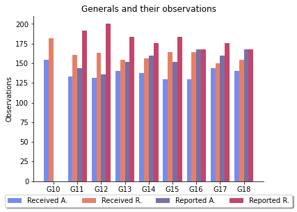
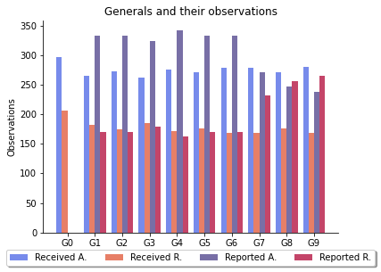
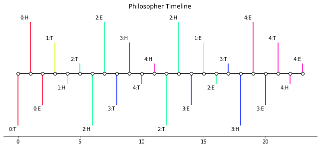
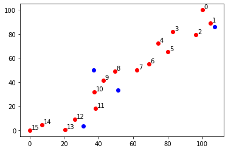

As part of the research for this project, an attempt has been made to visualize each story implementation in a suitable manner. Below follow a series of graphs for each of the stories.

## Byzantine Generals

The BGP posed some problems when it came to visualization as it was unclear what to *actually* visualize. The original idea was to draw a node graph representing the communications that take place between the generals, however, this quickly got messy, even with a small number of generals. This would be even more true for the recursive implementation of the communication algorithm. Thus, in the end, what was settled for is a simple bar graph which records the observations that each general receives from the other generals and the observations that he himself reports to the others.

## Dining Philosophers

Here, due to the threaded nature of the problem, it was most reasonable to simply construct a timeline of events. These events correspond to the philosophers thinking, getting hungry, and eating. The "time" here refers to, not actual time, but rather the size of the event queue and the ordering of events within this queue.

## Hansel and Gretel

The problem of H&G was mapped on a 2D grid with x and y coordinates, thus the representation chosen here is simply that of a 2-dimensional axis where the points represent the pebbles that Hansel dropped. Red and blue pebbles, together, make up all the pebbles that Hansel drops on his way to the forest. Red pebbles on their own mark his way back, while the blue ones are the pebbles he ignores. The red pebbles are also numbered, representing the order in which Hansel visits them.

